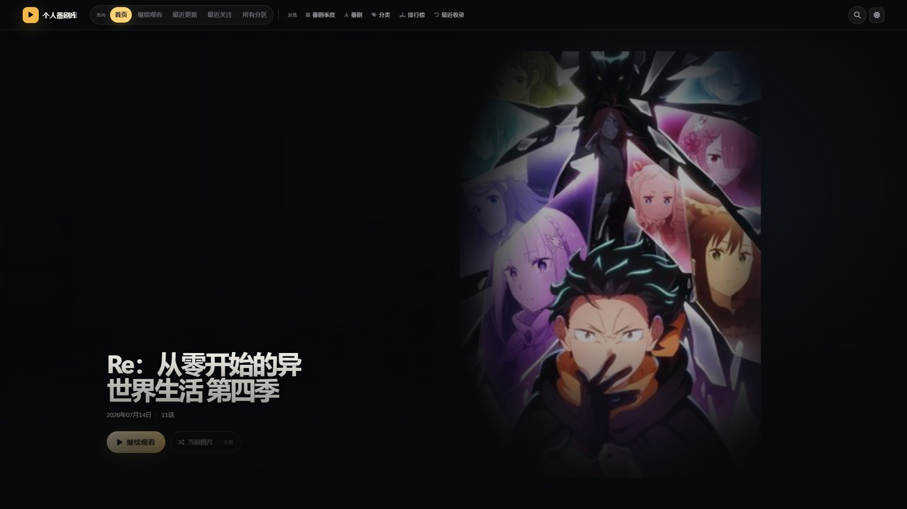
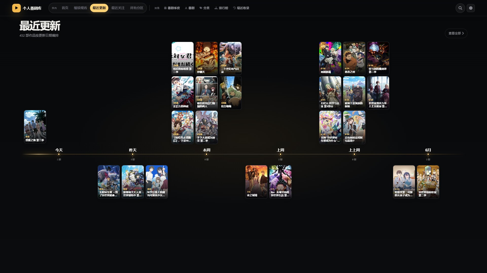
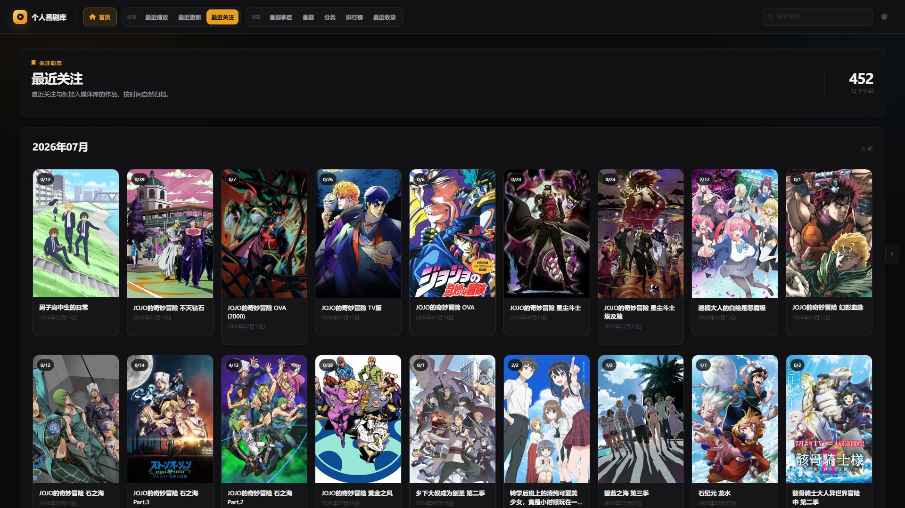
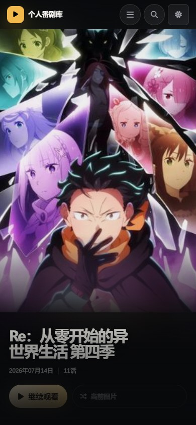
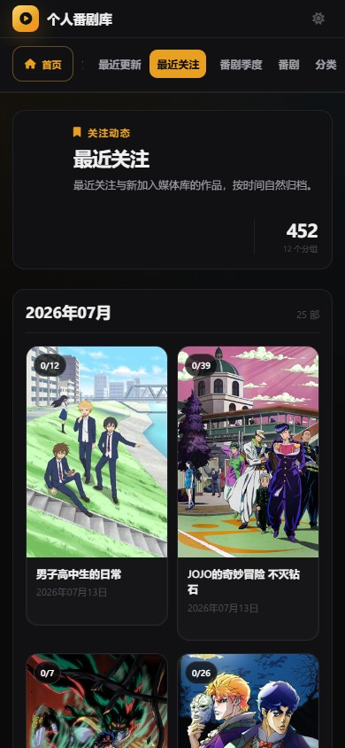

# DanDanPlay Personal Web Style

弹弹play Web1 的非官方影视化界面改版。保留原有媒体库、播放记录和 API 行为，重新组织首页 Hero、分区导航、更新时间轴、媒体库列表，并适配桌面端、手机竖屏以及明暗主题。



## 界面预览

### 最近更新时间轴



### 媒体库罗列



| 手机端首页 | 手机端媒体库 |
| --- | --- |
|  |  |

## 主要特性

- 全屏影视化 Hero，支持真实媒体库内容与多来源图片切换。
- 桌面端分区阶梯滚动，手机端保留原布局与自然滑动。
- 横向分组更新时间轴，以及更高信息密度的观看和关注列表。
- 首页与子页面使用统一导航，并保持各页面原有路由和数据逻辑。
- 完整适配深色、浅色主题与 `prefers-reduced-motion`。
- 一键安装、升级后重新应用，以及一键恢复安装前文件。

## 安装与回退

1. 从 GitHub Releases 下载源码压缩包并完整解压，不能直接在压缩包内运行。
2. 建议先退出弹弹play。
3. 双击 [`manage-style.bat`](manage-style.bat)。
4. 选择 `1` 安装或重新应用界面；选择 `2` 恢复最近一次安装前的文件。

脚本会自动定位 `%APPDATA%` 下的弹弹play Web1 目录。每次检测到官方文件或版本更新后的文件与覆盖包不同时，会先备份再安装。备份保存在：

```text
%LOCALAPPDATA%\DanDanPlay-Personal-Web-Style\backups
```

弹弹play版本更新覆盖网页后，再次运行脚本并选择 `1` 即可恢复界面。此时脚本会先保存更新后的官方文件，因此选择 `2` 可以退回对应的新版本官方界面。

> 跨大版本更新时，弹弹play可能调整 Web1 模板或 API。建议先使用菜单中的状态检查，并保留自动生成的备份。

## 当前覆盖范围

当前发布版本：`2.2`，基于弹弹play `18.1.0` Web1 调整。

公开包只包含改版实际需要覆盖或新增的文件：

```text
bangumi.html
filelist.html
index.html
style.sshtml
css/home-v18.css
css/main.css
js/library-navigation.js
```

没有附带媒体库数据、账号配置、服务器地址、播放记录或弹弹play自带的第三方前端依赖。

## 手动使用

需要自定义目标目录时，可直接调用管理脚本：

```powershell
pwsh -NoProfile -File .\scripts\manage-style.ps1 -Action install -TargetPath "D:\path\to\web"
pwsh -NoProfile -File .\scripts\manage-style.ps1 -Action restore -TargetPath "D:\path\to\web"
pwsh -NoProfile -File .\scripts\manage-style.ps1 -Action status -TargetPath "D:\path\to\web"
```

Windows PowerShell 5.1 同样可用。

## 声明

本项目是个人维护的非官方界面修改，与弹弹play官方无隶属或背书关系。界面中展示的作品图片由用户自己的媒体库与相应元数据服务提供，本仓库不分发番剧图片或媒体内容。

