# DanDanPlay Personal Web Style

弹弹play Web1 的非官方视觉与交互改版。3.2 在已确认的连续 CD 架基础上，进一步统一首页与 subpage 的播放转场、收拢番剧详情 dossier、修复碟片深度与边界 hover 所有权，并关闭 Hero 入场最后一处单帧露馅；现有 NancyFx 模板、媒体库 API、播放记录和文件路由保持不变。

> 3.2 公开包中的桌面模式仍显示为 Web1 3.0，以兼容已有版本偏好。它默认用于宽度大于 768px 的电脑端；手机与窄屏会自动使用 2.4 稳定布局，电脑端右上角仍可在 3.0 与稳定版间切换。

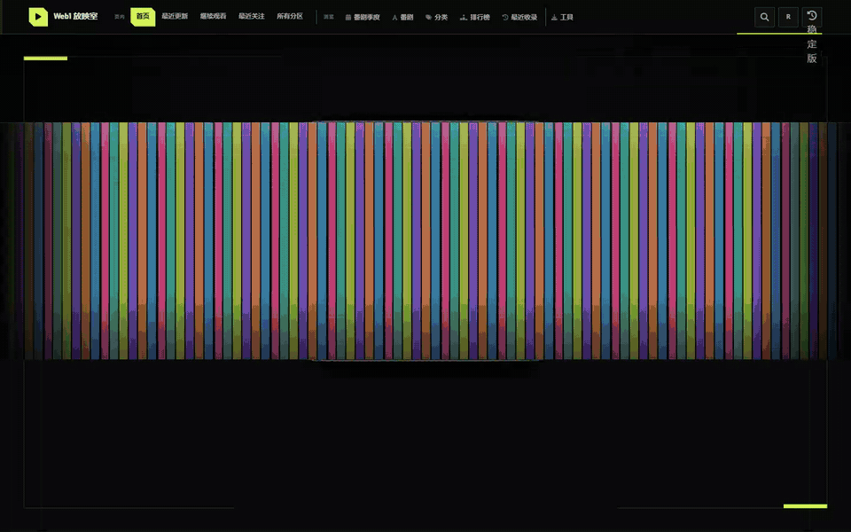

## 界面预览

### 连续 CD 架 Hero 与播放转场

最近播放作品组成从屏幕左侧贯穿到右侧的 CD 架：中间五张卡面展开阅读，外围书脊保持可识别。首个可见架子由缓存封面预合成并高速移动，完全停止后直接从同一几何展开，不会先缩成中央小架或弹出第二层。确认继续播放后，选中盒体打开、碟片以稳定直径装载到播放器，并通过项目定制的媒体闸门进入播放页。

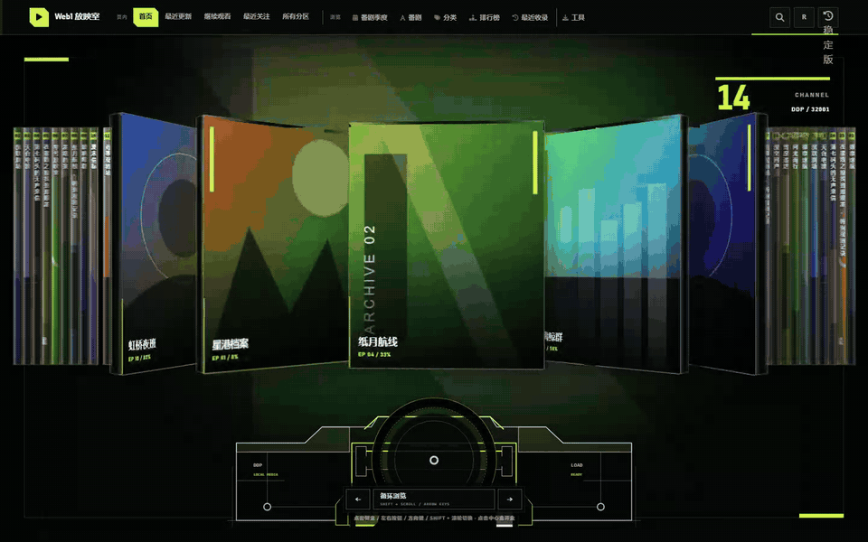

> 两段动图由 3.2 候选代码直接录制；使用 36 个虚构条目、8 种生成式抽象构图、缺图与迟解码案例，不含真实媒体清单、账号、服务器或播放记录。

### 七天更新与更早归档

首屏固定展示完整七天记录，单卡和多卡日期使用同一视觉尺寸，宽屏轨道充分利用两侧空间并保留清晰安全距；“更早”内容位于第二个横向页面，不会挤占七天信息。

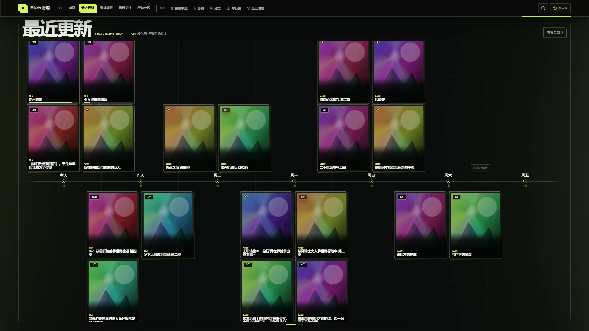

### 继续观看与全部分区

继续观看使用 6×2 媒体封套，并保留指针驱动的立体响应与详情抽屉。全部分区按“播放动态 / 番剧目录 / 文件入口”重新编排，路由与功能保持不变。

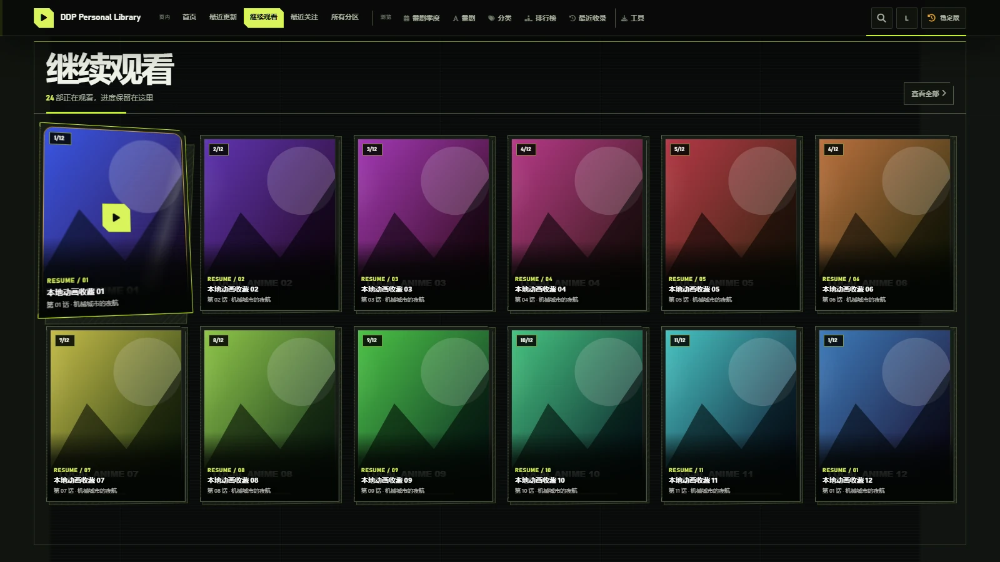

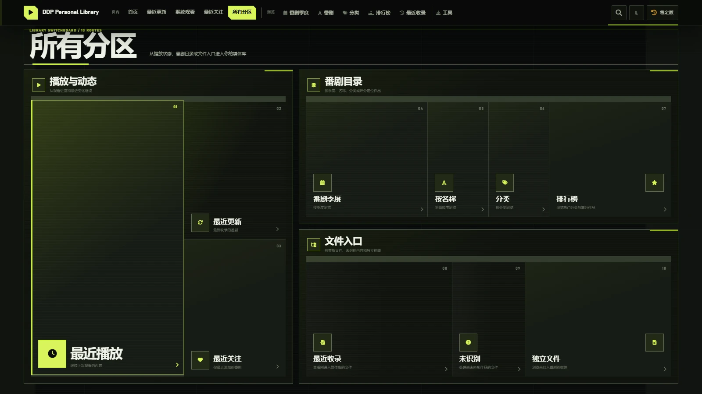

### 番剧库、文件列表与播放控制台

番剧库使用 6×2 分页式封套排布，并在桌面端以连续侧边 dossier 展示作品头图、全宽季度栏和全宽单集列表；不再保留一条空白竖栏。长列表启用离屏渲染与动效生命周期清理，从 dossier 单集文件进入播放页时也使用与 Hero 相同的放映闸门。文件列表与播放页继续使用同一套黑色、纸白和酸性绿的印刷机械语言。

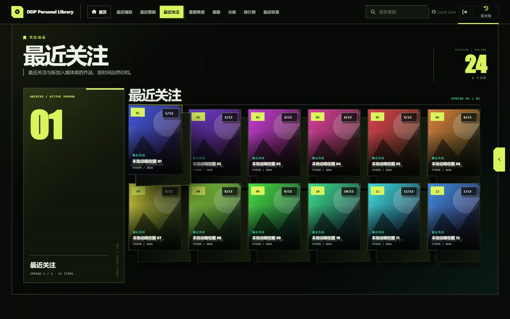

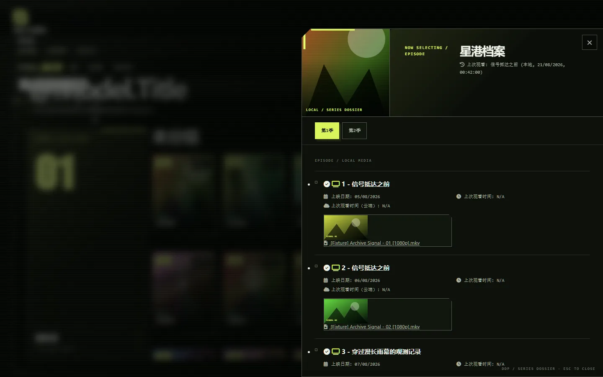

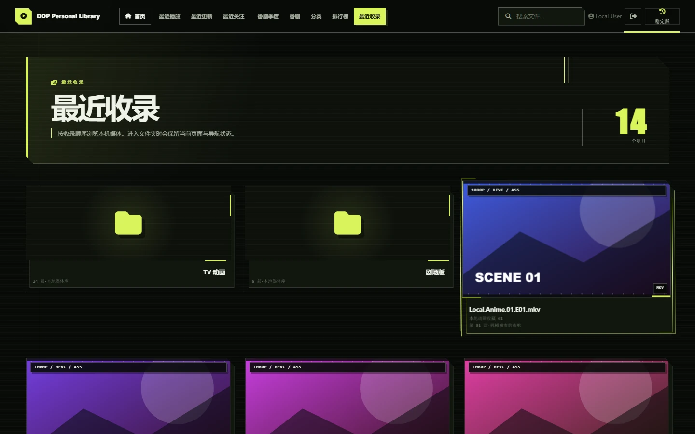

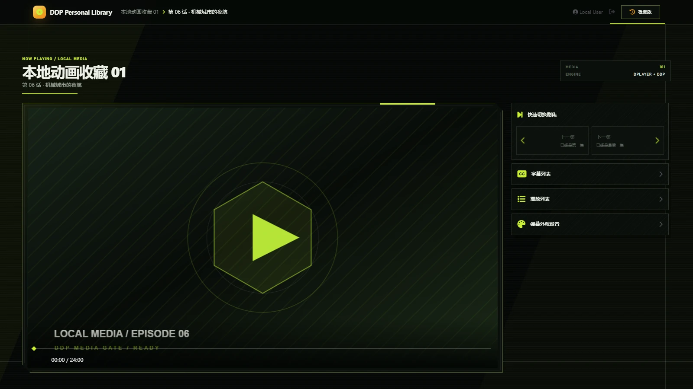

### 手机端稳定布局

| 首页 | 番剧库 |
| --- | --- |
| 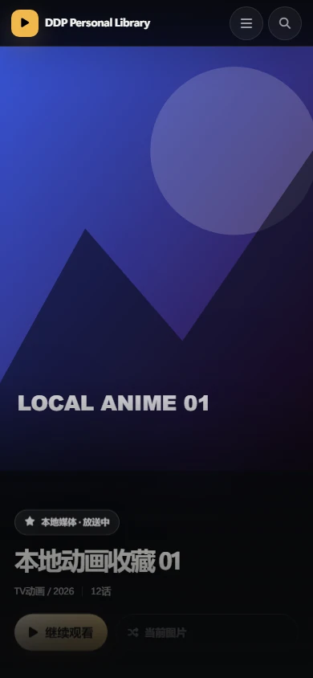 | 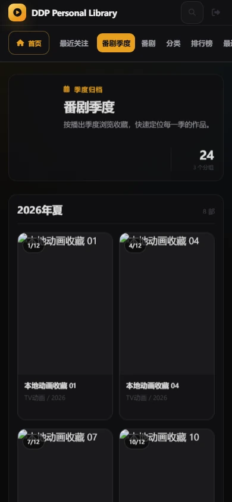 |

## 3.2 主要特性

- 桌面端默认启用 Web1 3.0，手机与 `<=768px` 窄屏自动回退到 2.4 稳定布局。
- 电脑端可持久化切换 3.0 / 稳定版，不再把明暗主题开关作为主入口。
- Hero 使用全宽连续 CD 架、五张可读卡面、外围书脊墙、风格化碟片和与播放器相接的媒体闸门转场。
- 首页与番剧库详情中的单集文件入口共用同一 `DdpRouteMorph` 离场；正常点击只提交一次，修饰键、新标签页和减少动效保留原生行为。
- 碟片与升降引导由 rack 外部舞台层持有，开盒、飞行和播放器状态保持同一可见直径，不再被 3D 深度排序压到盒体下方。
- 盒体阴影不接收 pointer 事件，不会越界抢走相邻侧置书脊的 hover；入场交接早期的上下边缘遮罩消除了最后一处单帧露边。
- 桌面番剧详情改为头图/标题、全宽季度栏、全宽剧集列表的一体式 dossier，并提高文字、缩略图与文件目标的可读性。
- 高速入场采用预合成轨道，单调减速并完全停止后才展开；预合成层与 live rack 的顺序、封面和几何保持连续。
- 相邻封面与背景会在提交选择前预载；缓存命中时背景和右上角信息与输入同周期更新。
- 修复连续切换、快速反向和首尾循环时两侧边界闪现大幅海报面的单帧问题。
- 最近更新首屏完整展示七天，第二页收纳更早记录；单卡/多卡等宽、卡片尺度更清晰，背景边缘不再形成溢出错觉。
- 继续观看和最近关注统一为媒体封套比例、信息层和指针驱动 3D 响应。
- 番剧库 6×2 spread、桌面详情抽屉、键盘操作、离屏渲染和长滚动性能治理。
- 文件列表保留最近收录、未识别、独立文件、本地目录和远程目录全部既有路由。
- 新增桌面播放控制台，覆盖载入、就绪、缓冲、空媒体与错误状态；保留 DPlayer、字幕、弹幕及剧集导航逻辑。
- 尊重 `prefers-reduced-motion`，不使用滚轮劫持或强制滚动脚本。
- 默认中文的一键管理器，支持安装、版本检查、备份、重新应用和恢复。

## 安装与回退

1. 从 GitHub Releases 下载源码压缩包并完整解压，请勿直接在压缩包内运行。
2. 建议先退出弹弹play。
3. 双击 [`manage-style.bat`](manage-style.bat)。
4. 选择 `1` 安装或重新应用界面；选择 `2` 恢复最近一次安装前的文件。

管理器默认使用中文；在主菜单选择 `4` 可以切换到英文。

安装前，管理器会优先读取 Web1 目录同级的 `dandanplay.exe` 版本，并以运行进程和 Windows 安装信息作为后备来源。检测结果与当前界面适配版本不一致，或无法识别版本时，会先显示警告并要求确认，不会静默覆盖。

脚本会自动定位 `%APPDATA%` 下的弹弹play Web1 目录。每次检测到官方文件或版本更新后的文件与覆盖包不同时，会先备份再安装。备份保存在：

```text
%LOCALAPPDATA%\DanDanPlay-Personal-Web-Style\backups
```

弹弹play版本更新覆盖网页后，再次运行脚本并选择 `1` 即可恢复界面。此时脚本会先保存更新后的官方文件，因此选择 `2` 可以退回对应的新版本官方界面。

> 跨大版本更新时，弹弹play可能调整 Web1 模板或 API。建议先使用菜单中的状态检查，并保留自动生成的备份。

## 更新说明

### 3.2

- 让首页和番剧详情的播放入口共用放映闸门转场，同时保留修饰键、新标签页与减少动效行为。
- 将 Hero 碟片飞行层移出 preserve-3d rack，保持盒内、飞行和播放器可见直径连续，修复碟片瞬移到盒体下方的问题。
- 禁止盒体阴影截获 pointer，修复扇形最外侧卡片影响相邻侧置书脊 hover 的问题。
- 收紧入场所有权交接的上下边缘遮罩，移除封闭彩色架上方一帧露出 live case 边框的问题。
- 重组桌面番剧 dossier，移除空白竖栏并扩大季度、剧集、缩略图与文件点击目标。
- README 新增两段隐私安全 Hero 动图，并以 3.2 实际 dossier 截图替换旧版抽屉图。
- 兼容目标保持为弹弹play `18.1.3`。

### 3.1

- 将首页 Hero 从单盒展示升级为贯穿屏幕的连续 CD 架，并保持五张展开卡面与外围书脊墙的一体感。
- 重建首屏入场为“预合成架子高速移动 → 单调刹停 → 稳定停驻 → 原位展开 → 背景与播放器灯光唤醒”，移除中途收缩和第二层弹出。
- 修复快速连续切换时左右扇形/书脊边界一帧闪现大幅海报的问题，并保持循环切换连续。
- 提前解码相邻封面与背景，使卡片、HUD 和背景选择及时同步。
- 将最近更新的单卡/多卡统一尺寸，扩大宽屏可读性与轨道利用率，并以柔和边缘光替代硬斜切背景。
- 更新管理器兼容目标到弹弹play `18.1.3`。

### 3.0

- 重启 Web1 3.0 桌面迁移，首页、番剧库、文件列表与播放页采用统一的媒体封套和放映控制台系统。
- 新增可切换且持久化的 3.0 / 稳定版模式；手机端始终使用稳定布局。
- 重构 Hero 开盒、碟片装载、资源预载和跨页播放转场。
- 重构七天更新时间轴、继续观看、最近关注和全部分区，并恢复原生页面吸附。
- 为番剧库与文件列表增加桌面样式、详情抽屉和长滚动性能优化。
- 新增桌面播放页状态机和与首页转场相接的播放器框架。

### 2.4

- 放大并重新排布首页最近更新卡片，优化时间轴日期分组和入场动画。
- 为最近更新加入未开始、观看中和已看完状态标记。
- 修复最近关注在不同桌面列数下最后一行无法填满的问题。

## 当前覆盖范围

当前发布版本：`3.2`，基于弹弹play `18.1.3` Web1 调整。

公开包只包含改版实际需要覆盖或新增的运行文件：

```text
bangumi.html
filelist.html
index.html
style.sshtml
video.html
css/home-v18.css
css/main.css
css/home-stable-mobile.css
css/home-v3-content.css
css/home-v3-hero.css
css/home-v3-hero-polish.css
css/page-morph-transition.css
css/web1-v3-filelist-desktop.css
css/web1-v3-library-desktop.css
css/web1-v3-video-desktop.css
js/home-stable-mobile.js
js/home-v3-content.js
js/home-v3-hero.js
js/library-navigation.js
js/page-morph-transition.js
js/recent-play-refresh.js
js/theme.js
js/video-v3-desktop.js
```

没有附带媒体库数据、账号配置、服务器地址、播放记录、测试报告或弹弹play自带的第三方前端依赖。截图与动图均来自隐私安全的虚构测试数据，不包含用户的真实媒体清单。

## 手动使用

需要自定义目标目录时，可直接调用管理脚本：

```powershell
pwsh -NoProfile -File .\scripts\manage-style.ps1 -Action install -TargetPath "D:\path\to\web"
pwsh -NoProfile -File .\scripts\manage-style.ps1 -Action restore -TargetPath "D:\path\to\web"
pwsh -NoProfile -File .\scripts\manage-style.ps1 -Action status -TargetPath "D:\path\to\web"
```

Windows PowerShell 5.1 同样可用。

命令行默认输出中文；可通过 `-Language en-US` 使用英文。非交互安装遇到版本不匹配时会安全退出，只有明确添加 `-Force` 才会继续：

```powershell
pwsh -NoProfile -File .\scripts\manage-style.ps1 -Action install -Force
```

## 声明

本项目是个人维护的非官方界面修改，与弹弹play官方无隶属或背书关系。界面中展示的作品图片由用户自己的媒体库与相应元数据服务提供，本仓库不分发番剧图片或媒体内容。
