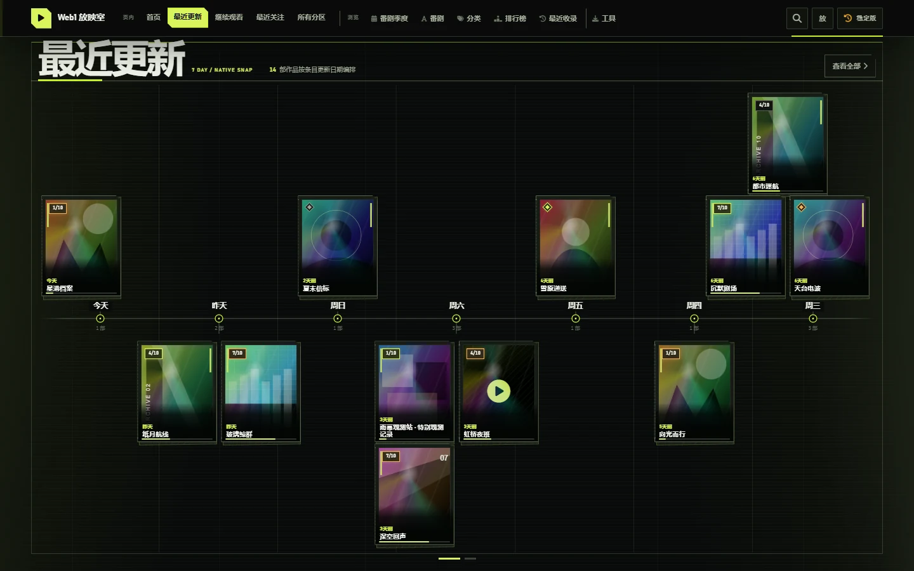
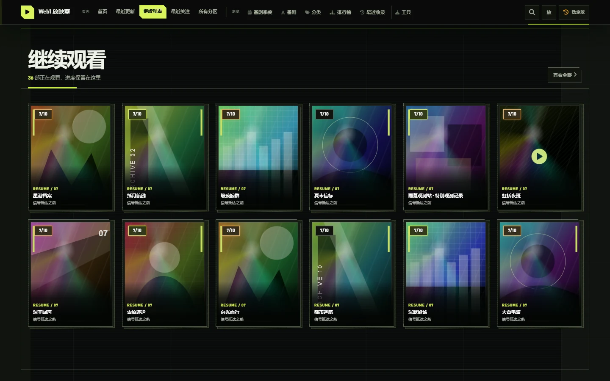
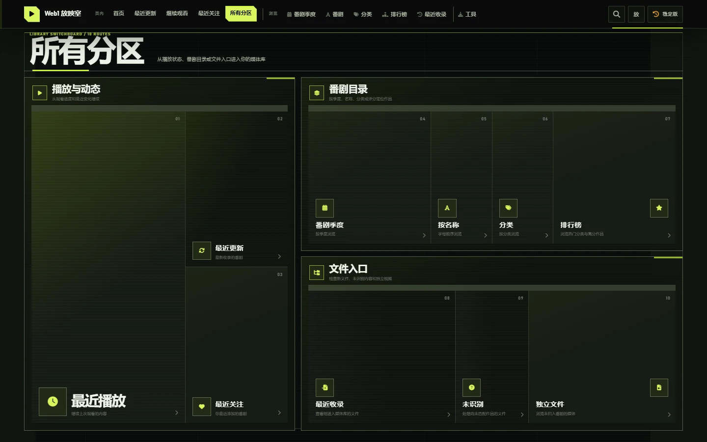
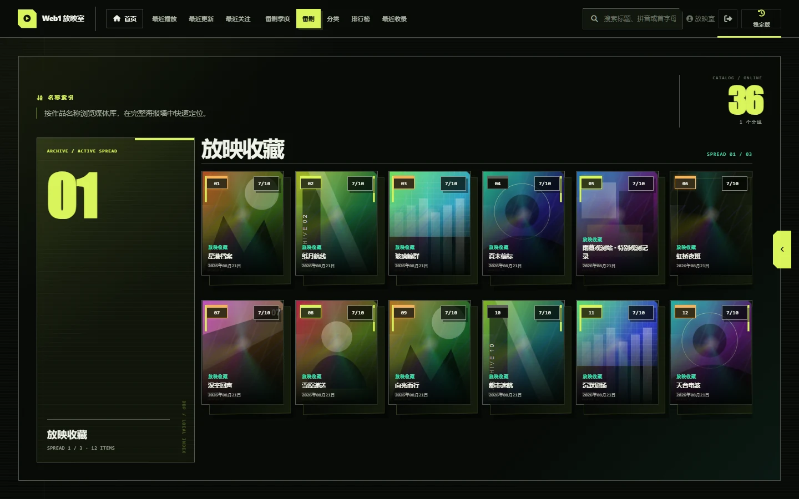
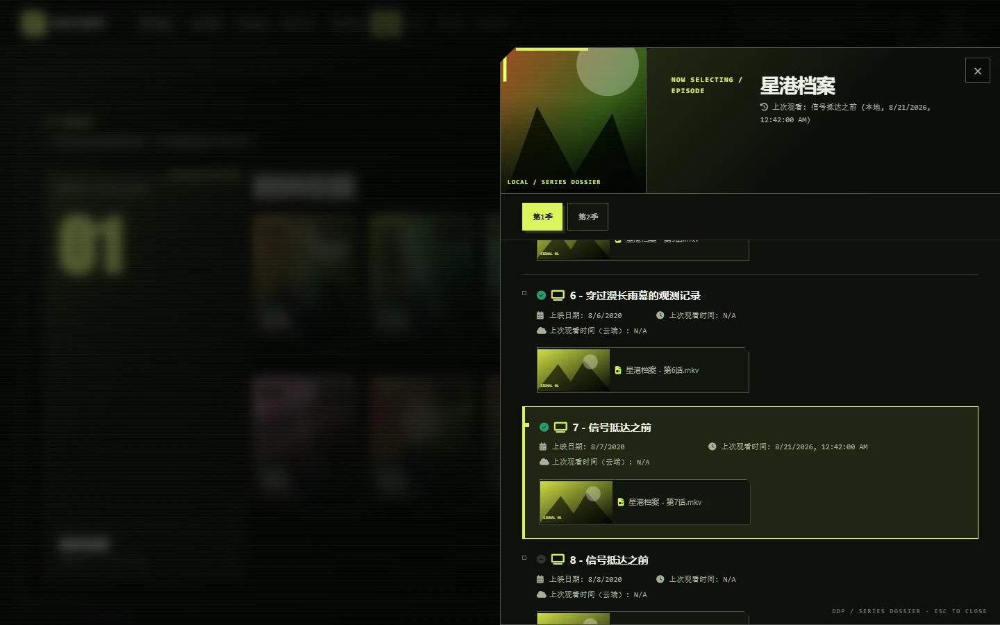
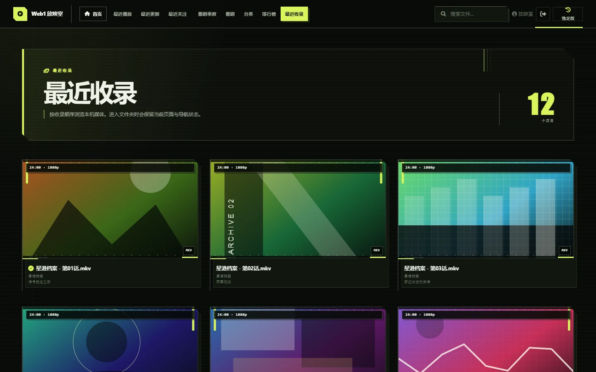
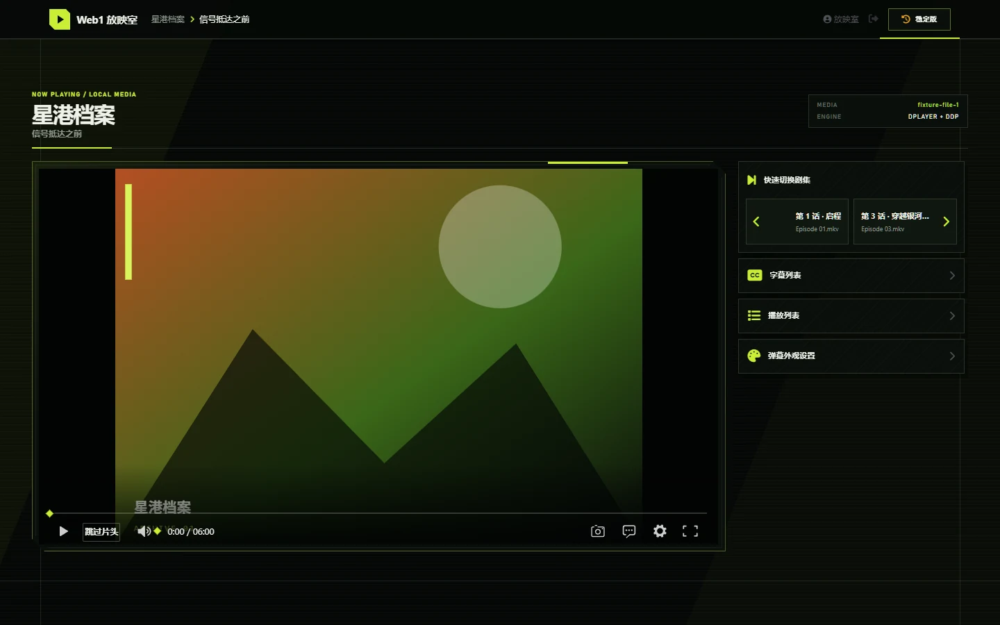
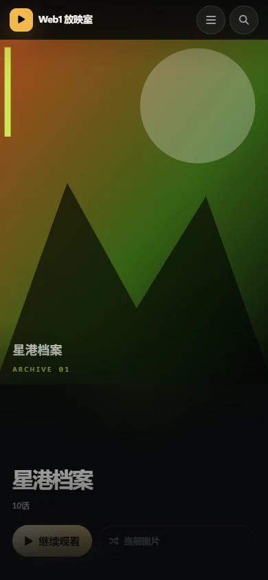
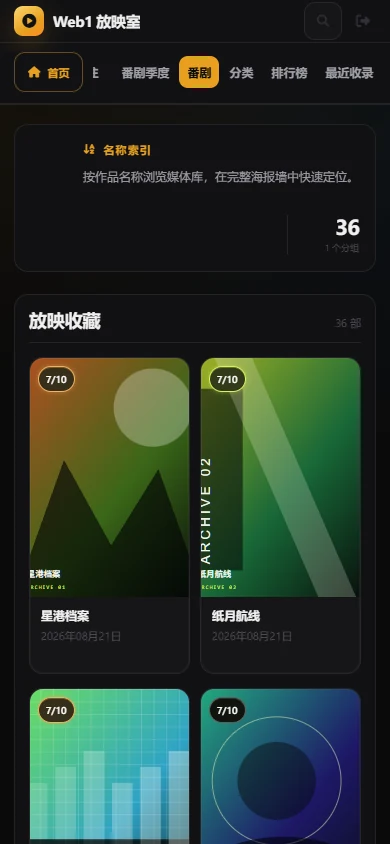

# DanDanPlay Personal Web Style

弹弹play Web1 的非官方视觉与交互改版，用连续 CD 架、媒体封套和放映控制台浏览自己的媒体库。

**当前版本：3.3 · 兼容弹弹play Windows 18.1.3**

**[下载 3.3 安装包 ZIP](https://github.com/OuNiSang/DanDanPlay-Personal-Web-Style/releases/download/3.3/DanDanPlay-Personal-Web-Style-3.3.zip)** · [版本说明与校验文件](https://github.com/OuNiSang/DanDanPlay-Personal-Web-Style/releases/tag/3.3)

3.3 改善首页首次展开、更新进度与本地文件核对、跨时区日期，以及进入播放器时的连续加载。播放器新增“跳过片头”，并提供可独立解压安装的 ZIP。

> 电脑端默认使用 3.x 界面，右上角可切换稳定版。宽度不超过 768px 时自动使用 2.4 稳定布局。桌面模式仍沿用 Web1 3.0 标识，以保留原有偏好设置。

## 界面预览

### 连续 CD 架与首次展开

最近播放作品排成一整架收藏。架子高速入场、减速停稳，再原位展开；中间卡面便于阅读，两侧书脊保持连续。3.3 只等待实际使用封面的加载与解码，其他分区、播放记录核对和外部搜图不再挡住首次展开。后到数据保留当前选中作品。


### 开盒、装载与播放

选择作品后打开盒体，点击碟片装入播放器并进入播放页。Hero 的过场从碟片开始；详情文件行、上下集和播放列表则从实际点击的矩形区域展开。慢请求期间保持加载，媒体元数据就绪后揭幕，支持取消及错误退出。


### 更新进度与最近观看

最近更新保留完整七天和“更早”归档。原有角标以**琥珀色**表示网络已更新、本地尚未跟上，以**酸绿色**表示确认本地已覆盖更新；信息不足时保持中性，不增加悬停文字。日期跟随访问者设备时区，兼容跨午夜和夏令时。







### 媒体库与播放器

番剧库保留分页封套、搜索、键盘操作及连续侧边详情。季度栏和剧集列表共用完整抽屉宽度。文件列表保留本地、远程、最近收录、未识别及独立文件入口。







播放键旁新增 **跳过片头**，每次前进 85 秒，保持原先播放或暂停状态并限制在片尾；支持键盘、全屏和触控，窄播放器会自动换行。



### 手机端

| 首页 | 番剧库 |
| --- | --- |
|  |  |

以上截图和 GIF 由 3.3 候选运行文件录制，使用虚构作品、八种构图、明暗封面、长短标题与缺图案例，不含真实媒体清单、账号、服务器或播放记录。GIF 是界面演示，不代表实际设备帧率。

## 安装与回退

1. 下载独立附件 **`DanDanPlay-Personal-Web-Style-3.3.zip`** 并完整解压，不要直接在压缩包内运行。
2. 建议先退出弹弹play。
3. 双击 `manage-style.bat`，选择 `1` 安装或重新应用。
4. 在弹弹play中开启远程访问，进入客户端显示地址的 `/web1/index.html`。
5. 需要回退时再次运行管理器并选择 `2`；选择 `3` 查看安装与版本状态。

安装包包含 28 个运行文件及管理器、许可证和安装说明；截图/GIF 留在项目主页。使用同一 Release 的 `.zip.sha256` 文件核对完整性。

管理器默认中文，主菜单选择 `4` 可切换英文。优先读取 Web1 目录同级的 `dandanplay.exe` 版本；版本不匹配或无法识别时会提示确认。3.3 的安装、状态、重复应用和回退使用 `18.1.3.0` 验证，无需跳过版本检查。

待覆盖文件有变化时先备份；重复应用同一版本不重复创建备份。回退恢复原有文件，并移除安装时新增的文件。备份位于：

```text
%LOCALAPPDATA%\DanDanPlay-Personal-Web-Style\backups
```

弹弹play更新覆盖网页后可重新安装。跨版本更新可能调整模板或 API，请先检查兼容目标并保留备份。

GitHub 自动生成的 `Source code` 压缩包仍可用，推荐使用独立安装附件。附件下载次数表示请求次数，不等于独立用户或安装人数；本项目没有为此添加使用遥测。

## 更新记录

### 3.3

- 首页首次展开只等待实际展示的图片，后到数据不重播入场或替换选中封面。
- 原有进度角标常驻显示琥珀色/酸绿色，修正已报告更新与本地文件的核对，详情不足时保持中性。
- 最近更新、Hero 和媒体库日期使用设备本地时区，保留日期归档层级，处理跨午夜与夏令时。
- 慢播放持续加载，等待真实媒体元数据就绪；取消、空源、错误及减少动效有明确出口。
- 六类播放入口按实际点击对象衔接，保留原生修饰键与新标签页行为。
- 新增“跳过片头”，前进 85 秒并保留播放/暂停、片尾、键盘、触控和全屏行为。
- 停止闲置装饰循环、回收常驻图层提示，并延迟加载屏外分区图片。
- 补足最近更新标题与导航栏的间距；番剧库缺图或图片加载失败时保留封套和标题，避免破图图标。
- 更新截图和效果 GIF，新增轻量安装 ZIP、SHA-256 附件及可复用打包脚本。

### 3.2

统一首页与详情播放转场，修复碟片深度、侧脊 hover 和入场边缘交接，重组连续全宽的番剧详情抽屉。

### 3.1

连续全宽 CD 架、原位展开和循环切换；重新平衡宽屏周更新卡片与边缘背景。

### 3.0 / 2.4

完成电脑端首页、媒体库、文件列表和播放器统一改版；手机与窄屏沿用 2.4 稳定布局。

## 验证范围

发布检查覆盖 2048、1440、1280、900、768 和 390px，正常、空内容、加载及失败状态，连续导航、播放交接、跳过片头和安装回退。保留 NancyFx 模板、现有媒体库 API、DPlayer、字幕、弹幕、播放记录、文件路由和版本偏好，不引入新生产依赖。

无头浏览器结果不代表实体手机或实际显卡认证。快速连续切换的 60Hz 帧预算与真实显卡表现尚未完成验收，**不承诺 60fps**；闲置渲染改善不表示所有设备均已流畅。不同编码、字幕与转码服务仍取决于弹弹play和浏览器。

## 自定义目录与打包

```powershell
pwsh -NoProfile -File .\scripts\manage-style.ps1 -Action install -TargetPath "D:\path\to\web"
pwsh -NoProfile -File .\scripts\manage-style.ps1 -Action status -TargetPath "D:\path\to\web"
pwsh -NoProfile -File .\scripts\manage-style.ps1 -Action restore -TargetPath "D:\path\to\web"
```

管理器兼容 Windows PowerShell 5.1。命令行遇到版本不匹配时默认退出；仅在自行确认兼容性后才考虑 `-Force`。

维护者可用 PowerShell 7 执行 `scripts/build-release.ps1 -Version 3.3`，向 `dist/` 生成 ZIP 与校验文件。脚本核对 manifest 和 payload 完整文件集合，并拒绝覆盖已有产物。

`payload/` 按实际测试源码保留文件字节，Git 不自动改写其中的行尾；安装附件与对应版本的 payload 可逐文件校验。

## 声明

本项目是个人维护的非官方界面修改，与弹弹play官方无隶属或背书关系。应用中的作品图片来自用户媒体库及元数据服务；公开包不附带真实番剧图片、媒体、账号配置、服务器地址、播放记录或弹弹play自带的第三方前端资源。
